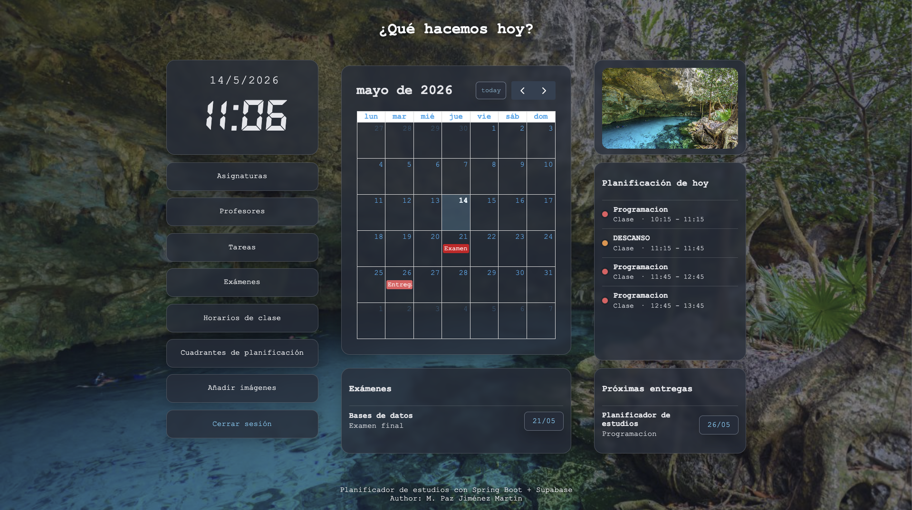
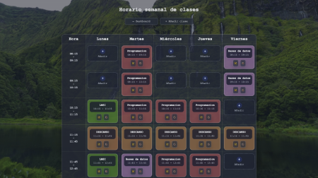
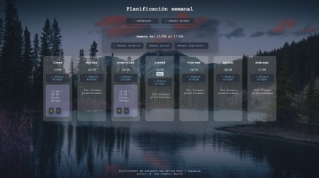

# Spring Boot Planner

Aplicación web de planificación académica desarrollada con Spring Boot + Thymeleaf.

Permite gestionar el estudio y la carga lectiva mediante módulos de asignaturas, tareas, exámenes, horarios y bloques de estudio, con un dashboard central para visualizar el estado general.

## Demo

- **Aplicación en vivo:** [https://spring-boot-planner.onrender.com](https://spring-boot-planner.onrender.com)

	 
	 
	 

## Funcionalidades actuales

- Autenticación de usuarios con Spring Security.
- Login y logout.
- Recuperación de contraseña por email con token temporal.
- Gestión de perfil de usuario.
- CRUD de:
  - Asignaturas
  - Profesores
  - Tareas
  - Exámenes
  - Horarios de clase
  - Bloques de estudio
- Dashboard con:
  - Calendario mensual
  - Planificación de hoy
  - Próximos exámenes
  - Próximas entregas
  - Imagen inspiradora
- Gestión de imágenes inspiradoras por usuario:
  - subida de imágenes a Cloudinary
  - persistencia de URL y `publicId`
  - borrado de imagen (Cloudinary + base de datos)
- Fondo del dashboard dinámico por sesión (si hay imágenes disponibles).

## Tecnologías

- Java 17
- Spring Boot
- Spring MVC
- Spring Data JPA
- Spring Data REST
- Spring Security
- Thymeleaf
- PostgreSQL (Supabase)
- Cloudinary
- Maven
- FullCalendar (frontend)

## Estructura del proyecto

- `src/main/java/com/planner/spring_boot_planner/`
  - `config/`  
    Configuración general (`SecurityConfig`, `CloudinaryConfig`, `RestConfig`, etc.)
  - `controller/`  
    Controladores web por módulo (dashboard, tareas, exámenes, usuarios, imágenes, etc.)
  - `entity/`  
    Entidades JPA
  - `repository/`  
    Repositorios Spring Data JPA / Data REST
  - `service/`  
    Servicios de dominio e integración externa (Cloudinary)
- `src/main/resources/`
  - `application.properties`
  - `static/`
    - `css/styles.css`
    - `javascript/script.js`
  - `templates/`
    - Vistas Thymeleaf por módulo (`dashboard`, `tareas`, `examenes`, `horariosClase`, `bloquesEstudio`, `imagenes`, etc.)

## Configuración de entorno

La aplicación usa variables de entorno para credenciales y secretos.

### Variables requeridas

- `SPRING_DATASOURCE_URL`
- `SPRING_DATASOURCE_USERNAME`
- `SPRING_DATASOURCE_PASSWORD`
- `MAIL_USERNAME`
- `MAIL_PASSWORD`
- `CLOUDINARY_CLOUD_NAME`
- `CLOUDINARY_API_KEY`
- `CLOUDINARY_API_SECRET`

